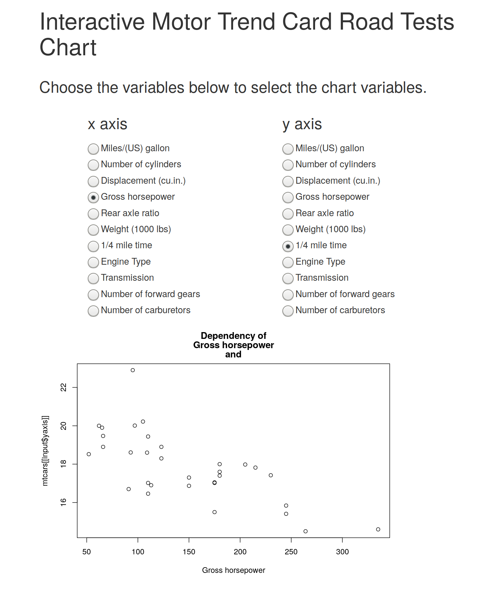
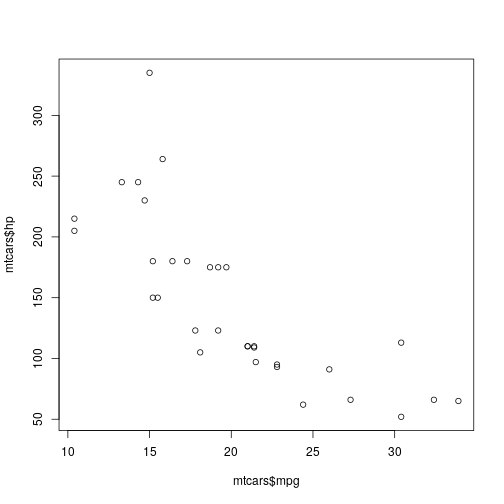

The Application
========================================================
author: Szymon Lipiński
date: 2019-08-12
autosize: true

The Application
========================================================
The application shows chart for the Motor Trend Car Road Tests data

- Two files, one for server, one for client.
- User can choose the variables to show on each of the axis.
- When a variable is chosen, the chart is redrawn.

Screenshot of the App
========================================================



The Plot
========================================================

The plot is made with the below code. The names of the variables are chosen by the user.


```r
plot(mtcars$mpg, mtcars$hp)
```



Links
========================================================

The data is available in the datasets package, description of the data can be found e.g. here:  https://stat.ethz.ch/R-manual/R-devel/library/datasets/html/mtcars.html

The code of this presentation and the client-server code are at https://github.com/szymonlipinski/data-products/tree/master/4
